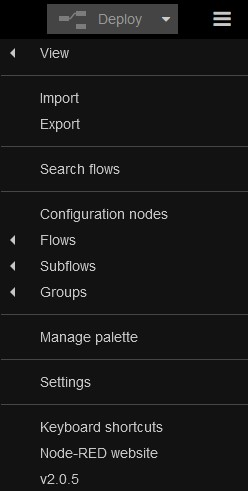
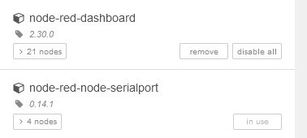
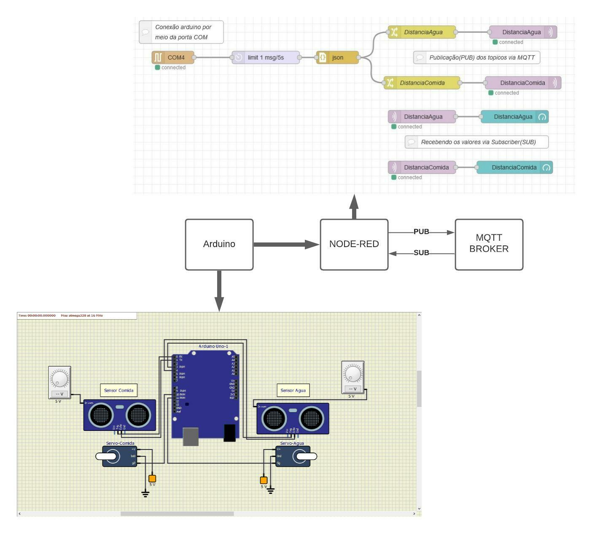

# Projeto de alimentador automático de Pet

Projeto de alimentador automático para pets utilizando o microcontrolador Arduino.

**Nome dos alunos:**

- João Paulo Pereira Macêdo - RM: 86353
- Karen Martins Silveira - RM: 85282
- Lucas Pelosi de Almeida - RM: 85987
- Mariana Alves de Oliveira Ribeiro - RM: 86125
- Tiago de Brito Ferreira - RM: 84267
- Vitor Mendes Olivério - RM: 84609

**Turma:** 2TDSG

**Ano:** 2021

## Objetivo / descrição do Projeto

O projeto foi desenvolvido para a matéria de Disruptive Architectures IOT and IA, do curso de Análise e Desenvolvimento de Sistemas da FIAP.

O intuito do projeto é uma aplicação IoT de alimentador automático desenvolvido para Smart Homes, ele faz a distribuição de água e ração por meio de atuadores e faz a coleta de informações por meio de sensores de aproximidade. A aplicação faz o envio das informações via serial para um fluxo no node-red que publica nos tópicos de cada sensor via MQTT e exibe em um dashboard.

**Dispositivos IoT utilizados:**

- Arduino Uno
- 2 sensores ultrassônico HC-SR04
- 2 fontes de voltagem 5v
- 2 servos

## Sotware e plataforma necessários

- SimulIDE
- Node-red

## Como instalar e configurar

**Passos para utilizar o SimulIDE:**

1. Faça o download

```
https://www.simulide.com/p/downloads.html
```

1. Descompacte o arquivo zip
2. O aplicativo estará na pasta bin

**Passos para utilizar o Node-red:**

1. É necessário a instalação do node.js LTS

```
https://nodejs.org/en/
```

1. Abra o cmd e digite:

```
npm install -g --unsafe-perm node-red
```

1. Para acessar o servidor, acesso no seu browser:

```
http://localhost:1880
```

**Download dos nós no node-red:**

Clique no canto superior direito, depois em “Manage palette”



**Faça a instalação desses nós:**



## Arquitetura do projeto



### Conexões do arduino e componentes:

<h4>Parte do alimento</h4>
<ul>
	<li><b>Porta 0 e 1: </b></li>
	<ul>
		<li><b>Sensor HC-SR04</b>(encontrado na área Micro -> Sensors): sensor ultrassôncio que mede a proximidade.</li>
        	<li>Fonte de voltagem de 5V</li>
      	</ul>
  	<li><b>Porta 10: </b></li>
	<ul>
		<li><b>Servo</b>(encontrado na área Output: atuador que abre e fecha despejando a comida.</li>
      		<ul>
        		<li><b>+V: </b> Rail de 5V</li>
        		<li><b>Gnb: </b> Terra</li>
      		</ul>
	</ul>
 </ul>
      
<h4>Parte da água</h4>
<ul>
	<li><b>Porta 3 e 4: </b></li>
	<ul>
		<li><b>Sensor HC-SR04</b>(encontrado na área Micro -> Sensors): sensor ultrassôncio que mede a proximidade.</li>
        	<li>Fonte de voltagem de 5V</li>
      	</ul>
  	<li><b>Porta 11: </b></li>
	<ul>
		<li><b>Servo</b>(encontrado na área Output: atuador que abre e fecha despejando a água.</li>
      		<ul>
        		<li><b>+V: </b> Rail de 5V</li>
        		<li><b>Gnb: </b> Terra</li>
      		</ul>
	</ul>
 </ul>

### Nós:

- **Serial In:** A COM4 está recebendo a conexão serial da COM3 que foi aberta no serial do Arudino dentro do SimulIde;
- **Delay:** Faz um delay de 5 segundos;
- **JSON:** O nó JSON está recebendo uma String JSON gerada pelo código do Arduino e converte em um Objeto JavaScript;
- **Change:** Filtra as informações do Objeto JavaScript (Distância água e alimento);
- **Mqtt Out:** Recebe a mensagem filtrada e publica as mensagens com o contéudo em um MQTT Broker;
- **Mqtt In:** Conecta com o Mqtt Broker e subscreve para mensagens de um tópico específico;
- **Gauge:** Adiciona uma interface Gauge para exibir as informações(Distância água e alimento) em um dashboard.

### Dados exibidos no **Gauge**:

- Distancia do sensor de água;
- Distancia do sensor de alimento;;

## Para clonar o projeto

1. Faça o download do Git Bash

```
https://git-scm.com/downloads
```

1. Abra o Git Bash e digite:

```
cd /Users/samsung/Documents
```

Use o comando “cd” para trocar até o diretório que vc deseja fazer o clone.

```
ls -l
```

Use o comando “ls -l” para listar os arquivos que estão no diretório atual.

Use o comando “git clone (link do repositório)” para fazer um clone do repositório.

```
ls -l
```

Use o comando “ls -l” para listar os arquivos e cheque se fez o clone do projeto.

## Link de vídeo demonstração

### Referências

- [Node-red](https://nodered.org/docs/getting-started/local)
- [SimulIDE](https://www.simulide.com/index.html)
- [Conexão m2m com Serial](https://www.youtube.com/watch?v=I6YIPL_p-L0)
